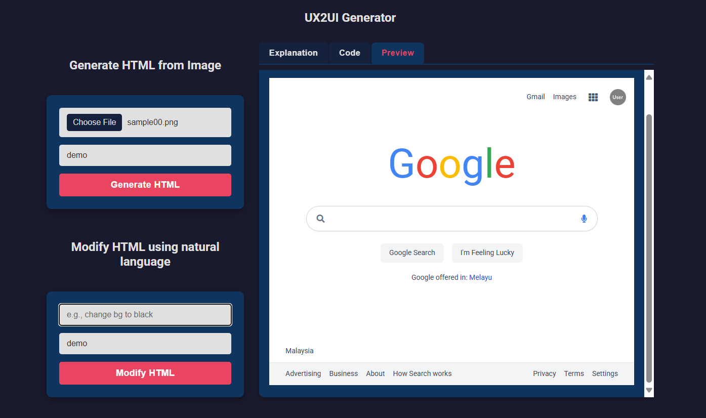

# 🧠 UX2UI: Image-to-Code-Generator & Modifier

A lightweight AI-powered web tool that converts UX design screenshots into HTML code, and allows users to modify the HTML using simple natural language queries.

Built with **FastAPI** for the backend and a minimal **vanilla HTML/JS** frontend.

---

## 🚀 Features

- 🖼 Upload an image (mockup or screenshot) and convert it into HTML.
- 💬 Modify the HTML using queries like: `"change background to black"`.
- 📄 View raw HTML, a plain-English explanation, and a live preview.
- 🧠 Powered by a generative AI model (Gemini / Google Generative AI).
- 🔍 Fully local setup for rapid prototyping.

---

## 📁 Project Structure

```

ux2ui/
├── backend/
│   ├── ux2ui/
│   │   ├── app.py                  # FastAPI app entrypoint
│   │   ├── prompts\_bundle/
│   │   │   └── generateHTML.py     # Generates HTML from image
│   │   ├── features/
│   │   │   └── chat2modify/
│   │   │       └── chat2modify.py  # Modifies HTML via query
│   │   └── utils/
│   │       └── post\_processing.py  # HTML parsing and explanation
│   ├── temp\_uploads/               # Temporary uploaded images
│   └── .venv/                      # Python virtual environment
├── frontend/
│   └── index.html                  # UI for uploading and modifying
└── README.md

````

---

## 🛠️ Getting Started

### 1. Clone the repository

```bash
git clone https://github.com/your-username/ux2ui.git
cd ux2ui
````

### 2. Set up the backend

```bash
cd backend
python -m venv .venv
.venv\Scripts\activate          # For Windows
# source .venv/bin/activate    # For Mac/Linux

pip install -r requirements.txt
```

### 3. Start the backend

```bash
.venv\Scripts\uvicorn.exe ux2ui.app:app --reload
```

Visit: [http://127.0.0.1:8000/docs](http://127.0.0.1:8000/docs) to test APIs.

---

### 4. Run the frontend

Open a new terminal:

```bash
cd frontend
python -m http.server 5500
```

Then open: [http://localhost:5500](http://localhost:5500)

---

## 🔗 API Endpoints

### `POST /generateHTML/`

Uploads an image and returns:

* Generated HTML
* Human-readable explanation

**Form Data:**

* `file`: image file
* `app_name`: name for storing/retrieving HTML

---

### `POST /modifyHTML/`

Modifies the previously generated HTML using a natural language query.

**Form Data:**

* `query`: e.g., `"change background to black"`
* `app_name`: previously used name

---

## 🧠 Example Use Case

1. Upload a screenshot like a login page.

2. It returns HTML + explanation like:

   > This is a centered login form with username and password fields.

3. Ask:

   > "Change the background color to dark gray"

4. The modified HTML and updated explanation are returned + previewed live.

---

## 📸 UI Preview



---

## 👨‍💻 Author

**Vidipt Vashist**
[LinkedIn](https://www.linkedin.com/in/vidiptvashist/)
[Email](mailto:vidipt.vashist@gmail.com)

---

## 📝 License

MIT License – free to use, modify, and distribute.

---

## 🌱 Coming Soon

* React-based frontend with Tailwind CSS
* Persistent history and rollback
* Cloud deployment (Render/Vercel)

```
